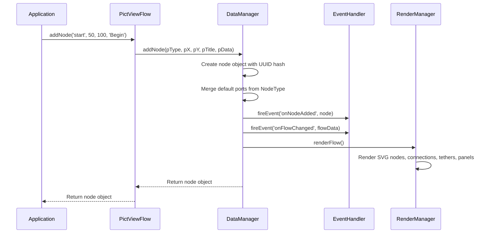
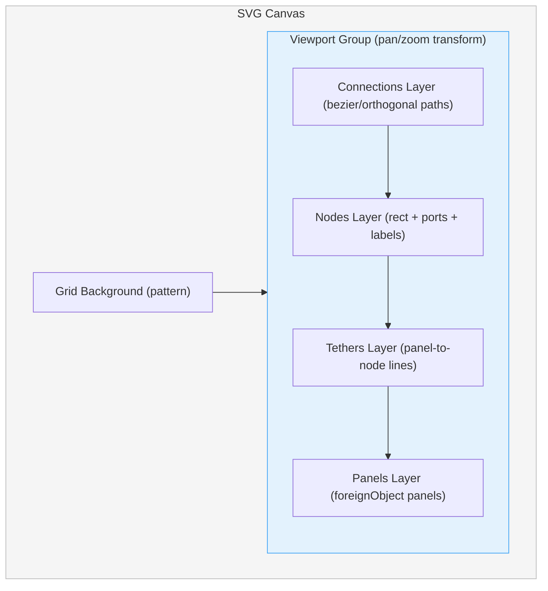
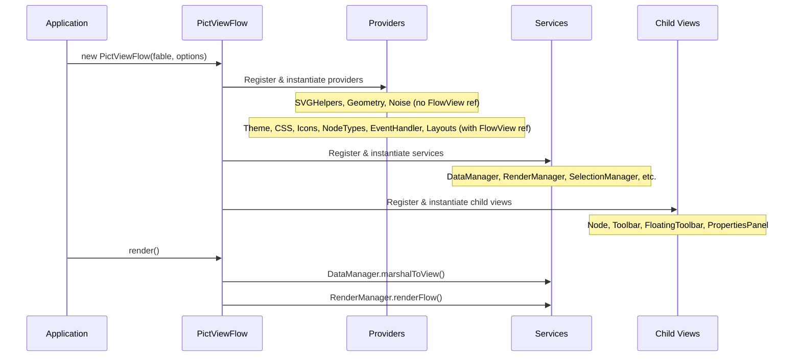

# Architecture

Pict-Section-Flow follows the standard Pict layered architecture -- Views for rendering, Services for business logic, and Providers for configuration and stateless utilities. All components register with a Fable instance through the service provider pattern.

## High-Level Design

```mermaid
graph TB
    subgraph Application["Your Application"]
        AppCode[Application Code]
        AppData[Pict AppData Store]
    end

    subgraph FlowView["PictViewFlow (Main Entry Point)"]
        direction TB
        FV[PictViewFlow]
    end

    subgraph Views["Views (Rendering)"]
        NodeView[Flow Node View]
        ToolbarView[Toolbar View]
        FloatingToolbar[Floating Toolbar View]
        PanelView[Properties Panel View]
    end

    subgraph Services["Services (Business Logic)"]
        DM[DataManager]
        RM[RenderManager]
        SM[SelectionManager]
        VM[ViewportManager]
        PM[PanelManager]
        IM[InteractionManager]
        LS[Layout Service]
        CR[ConnectionRenderer]
        PG[PathGenerator]
        PR[PortRenderer]
        CHM[ConnectionHandleManager]
        TM[Tether Service]
    end

    subgraph Providers["Providers (Configuration)"]
        NTP[NodeTypes Provider]
        EHP[EventHandler Provider]
        LP[Layouts Provider]
        TP[Theme Provider]
        CP[CSS Provider]
        GP[Geometry Provider]
        NP[Noise Provider]
        SVG[SVGHelpers Provider]
        CSP[ConnectorShapes Provider]
        IP[Icons Provider]
        PCP[PanelChrome Provider]
    end

    subgraph Extension["Extension Points"]
        FC[PictFlowCard]
        FCP[PictFlowCardPropertiesPanel]
        PT[Panel: Template]
        PMD[Panel: Markdown]
        PF[Panel: Form]
        PVW[Panel: View]
    end

    AppCode --> FV
    FV <--> AppData
    FV --> Views
    FV --> Services
    FV --> Providers

    DM <--> AppData
    RM --> NodeView
    RM --> CR
    PM --> PanelView
    IM --> SM
    IM --> VM
    CR --> PG
    CR --> PR

    FC --> NTP
    FCP --> PM
    PT --> PanelView
    PMD --> PanelView
    PF --> PanelView
    PVW --> PanelView

    EHP --> AppCode

    style Application fill:#e8f5e9,stroke:#42b983,color:#333
    style FlowView fill:#e3f2fd,stroke:#42a5f5,color:#333
    style Views fill:#fce4ec,stroke:#ef5350,color:#333
    style Services fill:#fff3e0,stroke:#ffa726,color:#333
    style Providers fill:#f3e5f5,stroke:#ab47bc,color:#333
    style Extension fill:#e0f2f1,stroke:#26a69a,color:#333
```



## Data Flow

All mutations flow through a predictable pipeline:



## SVG Layer Structure

The rendering system uses SVG group elements in a specific z-order:



Connections render behind nodes so lines do not obscure node bodies. Tethers render above nodes so the connecting line from a panel to its node is always visible. Panels render last so they float above everything.

## Component Roles

### Views

| View | Role |
|------|------|
| `PictViewFlow` | Main entry point. Orchestrates services, providers, and child views. Exposes the public API. |
| `PictViewFlowNode` | Renders individual node SVG groups (title bar, body, ports, labels). |
| `PictViewFlowToolbar` | Renders the docked toolbar with palette cards, zoom controls, and layout buttons. |
| `PictViewFlowFloatingToolbar` | Renders context-sensitive floating toolbar on node selection. |
| `PictViewFlowPropertiesPanel` | Renders panel chrome and delegates content to panel type handlers. |

### Services

| Service | Role |
|---------|------|
| `DataManager` | CRUD for nodes and connections. Marshals to/from AppData. Fires data events. |
| `RenderManager` | Orchestrates full and partial re-renders. Delegates to node, connection, and panel renderers. |
| `SelectionManager` | Tracks selected node, connection, or tether. Fires selection events. |
| `ViewportManager` | Pan, zoom, fullscreen, coordinate transforms. |
| `PanelManager` | Open, close, toggle, and position properties panels. |
| `InteractionManager` | Pointer and keyboard event handling. State machine for drag modes. |
| `Layout Service` | Grid snap math and topological auto-layout algorithm. |
| `ConnectionRenderer` | Renders bezier and orthogonal paths with arrowheads. |
| `PathGenerator` | Pure math: bezier curves and orthogonal routing. |
| `PortRenderer` | Renders port circles on node boundaries. |
| `ConnectionHandleManager` | Manages bezier control point state for manual path adjustments. |
| `Tether` | Renders the connecting lines between panels and their parent nodes. |

### Providers

| Provider | Role |
|----------|------|
| `NodeTypes` | Registry of available node types. Cards register here. |
| `EventHandler` | Named event system with multi-handler support. |
| `Layouts` | Save/restore/delete layout snapshots. Pluggable storage backend. |
| `Theme` | Named theme registry. Applies CSS variable overrides. |
| `CSS` | Generates and injects all CSS into Pict's CSSMap service. |
| `Geometry` | Port positioning math: local coordinates, minimum node height, port counts by side. |
| `Noise` | Perlin-like noise for the hand-drawn rendering effect. |
| `SVGHelpers` | DOM utilities for creating and manipulating SVG elements. |
| `ConnectorShapes` | SVG marker definitions for arrowheads by port type. |
| `Icons` | Icon template library for toolbar and node UI. |
| `PanelChrome` | Panel title bar and tab bar template generation. |

## Flow Data Structure

The canonical flow state is a plain JavaScript object:

```javascript
{
	Nodes:
	[
		{
			Hash: 'node-<UUID>',
			Type: 'start',
			X: 50, Y: 180,
			Width: 140, Height: 80,
			Title: 'Start',
			Ports:
			[
				{
					Hash: 'port-<UUID>',
					Direction: 'output',
					Side: 'right',
					Label: 'Out',
					PortType: 'event'
				}
			],
			Data: {}
		}
	],

	Connections:
	[
		{
			Hash: 'conn-<UUID>',
			SourceNodeHash: 'node-...',
			SourcePortHash: 'port-...',
			TargetNodeHash: 'node-...',
			TargetPortHash: 'port-...',
			Data:
			{
				LineMode: 'bezier',
				HandleCustomized: false
			}
		}
	],

	OpenPanels:
	[
		{
			Hash: 'panel-<UUID>',
			NodeHash: 'node-...',
			PanelType: 'Template',
			Title: 'Properties',
			X: 300, Y: 250,
			Width: 300, Height: 200
		}
	],

	SavedLayouts: [],

	ViewState:
	{
		PanX: 0, PanY: 0,
		Zoom: 1,
		SelectedNodeHash: null,
		SelectedConnectionHash: null,
		SelectedTetherHash: null
	}
}
```

## Service Initialization Sequence

When PictViewFlow initializes, it follows a declarative registry to instantiate all components:



## Design Patterns

### Service Provider Pattern

Every service and provider extends `fable-serviceproviderbase` and registers with the Fable instance. This means any component can access any other through `this.fable` without explicit imports or singletons.

### Event-Driven Architecture

The `EventHandlerProvider` decouples application code from the flow internals. Services fire events; application code registers handlers. This avoids subclassing or monkey-patching to extend behavior.

### Data/View Separation

The flow data structure is completely separate from the SVG DOM. Mutations operate on the data model; the render manager regenerates the DOM from the model. This makes serialization, undo/redo, and server sync straightforward.

### Selective Re-rendering

Full re-renders are used when the graph topology changes (node added/removed, connection added/removed). During interactive operations like node dragging, only the affected elements (the dragged node and its connections) are updated for smooth performance.
