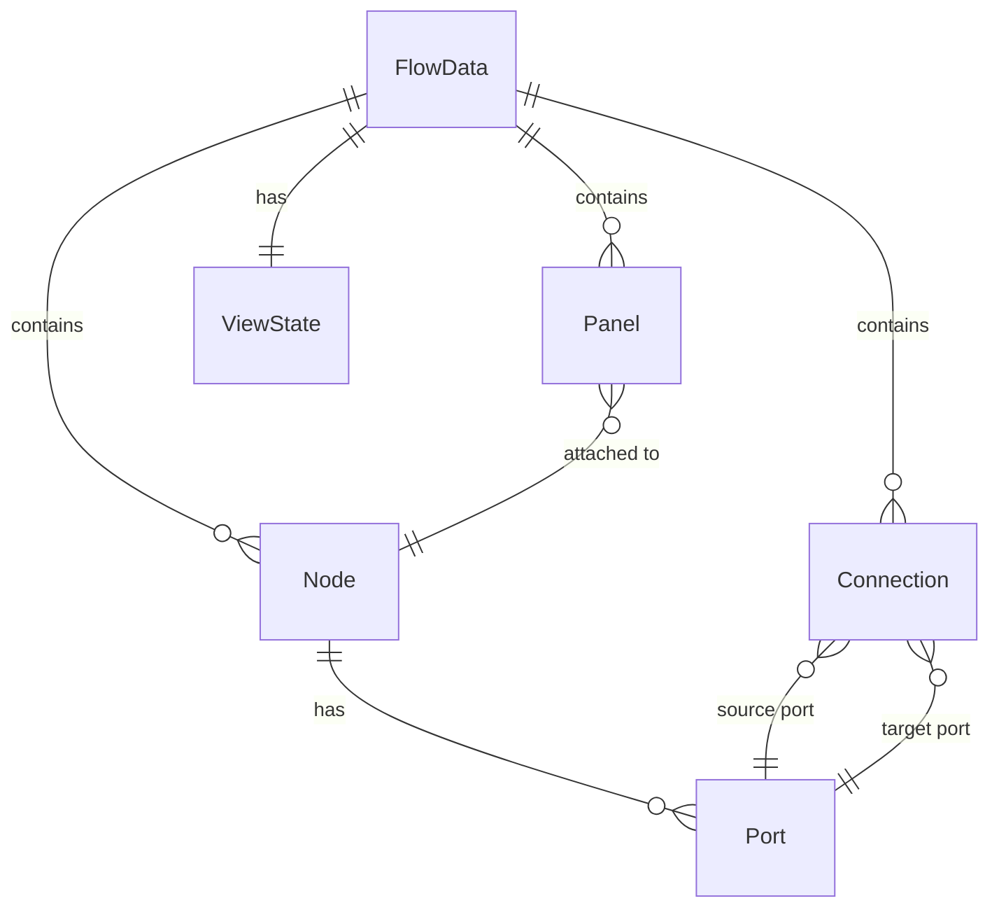

# Data Model

The entire flow graph state is represented by a single JSON object called **FlowData**. Every mutation goes through the `DataManager` service and triggers a re-render. This structure is what gets persisted when you call `marshalFromView()` and restored with `marshalToView()`.

## FlowData Structure

```javascript
{
    Nodes: [],           // Array of node objects
    Connections: [],     // Array of connection objects
    OpenPanels: [],      // Array of panel objects
    SavedLayouts: [],    // Array of layout snapshots
    ViewState:
    {
        PanX: 0,         // Viewport horizontal offset
        PanY: 0,         // Viewport vertical offset
        Zoom: 1,         // Viewport zoom level
        SelectedNodeHash: null,
        SelectedConnectionHash: null,
        SelectedTetherHash: null
    }
}
```

## Node

Each node represents a discrete operation in the flow graph.

```javascript
{
    Hash: 'abc123',          // Unique identifier (auto-generated)
    Type: 'ITE',             // Card type code (references NodeTypes)
    X: 200,                  // Horizontal position in SVG space
    Y: 150,                  // Vertical position in SVG space
    Width: 200,              // Node width in pixels
    Height: 100,             // Node height in pixels
    Title: 'If-Then-Else',   // Display title on the node
    Ports:                   // Array of port definitions
    [
        {
            Hash: 'port-1',
            Direction: 'input',         // 'input' or 'output'
            Side: 'left',              // Port position on node edge
            Label: 'In',              // Port label text
            PortType: 'event-in',     // Optional type for coloring
            DataType: 'boolean',      // Optional data type hint
            MinimumInputCount: 1,     // Minimum connections (0 = optional)
            MaximumInputCount: 1      // Maximum connections (-1 = unlimited)
        }
    ],
    Style:                   // Optional per-node style overrides
    {
        BodyFill: '#fef5e7',
        BodyStroke: '#e67e22',
        BodyStrokeWidth: 1,
        TitleBarColor: '#e67e22'
    },
    Data: {}                 // User-defined payload (card-specific)
}
```

### Port Side Positions

Ports can be placed at 12 positions around the node perimeter using a zone system:

```
top-left        top         top-right
left-top       (body)       right-top
left                        right
left-bottom    (body)       right-bottom
bottom-left    bottom       bottom-right
```

The legacy four-value sides (`left`, `right`, `top`, `bottom`) map to the middle zone of each edge.

## Connection

A connection links an output port on one node to an input port on another.

```javascript
{
    Hash: 'conn-1',
    SourceNodeHash: 'node-a',
    SourcePortHash: 'port-out',
    TargetNodeHash: 'node-b',
    TargetPortHash: 'port-in',
    Data:
    {
        LineMode: 'bezier',       // 'bezier' or 'orthogonal'
        HandleCustomized: false,  // True if handles have been manually moved

        // Bezier handles (multi-point curve control)
        BezierHandles: [{ x: 300, y: 175 }],

        // Orthogonal handles (right-angle path corners)
        OrthoCorner1X: 250,
        OrthoCorner1Y: 150,
        OrthoCorner2X: 350,
        OrthoCorner2Y: 200,
        OrthoMidOffset: 0
    }
}
```

### Connection Routing

Connections support two path modes:

- **Bezier** (default) -- Smooth curves with one or more control handles. Right-click a connection to add a handle; drag handles to reshape the curve.
- **Orthogonal** -- Right-angle paths with two corner points. Double-click a connection handle to toggle between bezier and orthogonal modes.

## Panel

An open properties panel associated with a node.

```javascript
{
    Hash: 'panel-1',
    NodeHash: 'node-a',          // The node this panel belongs to
    PanelType: 'Form',           // 'Template', 'Markdown', 'Form', 'View', or 'Info'
    Title: 'Set Value Properties',
    X: 450,                      // Panel position in SVG space
    Y: 100,
    Width: 320,
    Height: 200
}
```

Each panel is rendered as an HTML `foreignObject` inside the SVG, with a tether line connecting it to its parent node. Panels can be dragged, resized, and have tabbed views for Properties, Help, and Appearance.

## ViewState

Viewport and selection state, persisted with the flow data.

```javascript
{
    PanX: -120,                       // Horizontal pan offset
    PanY: -50,                        // Vertical pan offset
    Zoom: 0.85,                       // Zoom level (0.1 to 5.0)
    SelectedNodeHash: 'node-a',       // Currently selected node (null if none)
    SelectedConnectionHash: null,     // Currently selected connection
    SelectedTetherHash: null          // Currently selected tether line
}
```

## Relationships


